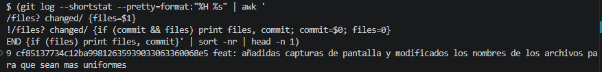
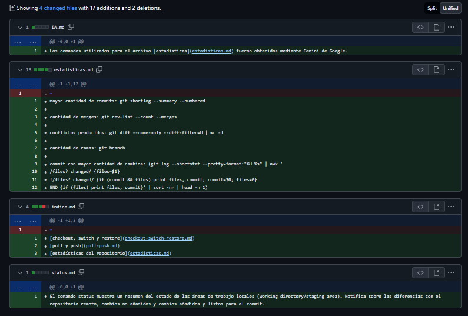
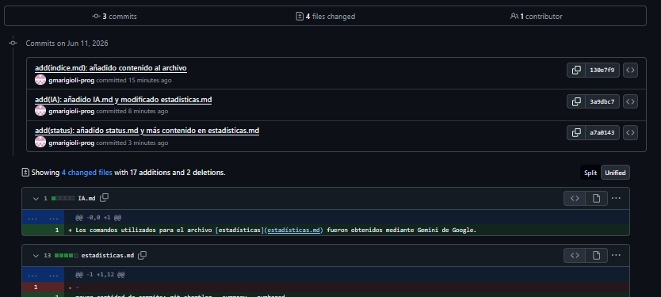

Mayor cantidad de commits: Gino Marigioli, 16 commits totales. Comando utilizado: git shortlog --summary --numbered

Cantidad total de merges: 27. Comando utilizado: git rev-list --count HEAD

Conflictos producidos actualmente: 0.  Comando utilizado: git diff --name-only --diff-filter=U | wc -l 

Cantidad de ramas: 5 (En repositorio remoto). Comando utilizado: git branch -r && echo "Total count:" && git branch -r | wc -l

Commit con mayor cantidad de archivos cambiados: Commit 85137734 (9 archivos cambiados). Comando utilizado:(git log --shortstat --pretty=format:"%H %s" | awk '
/files? changed/ {files=$1} 
!/files? changed/ {if (commit && files) print files, commit; commit=$0; files=0} 
END {if (files) print files, commit}' | sort -nr | head -n 1)

Conflicto:

